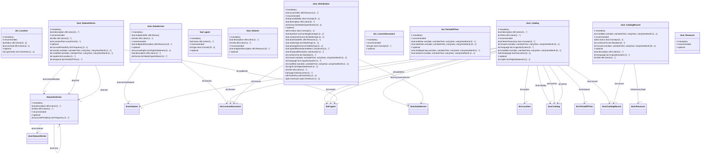

```mermaid 
classDiagram

class `dct_Location` {
  # mandatory
  # recommended
  dcat#58;bbox rdfs#58;Literal [0...1] 
  dcat#58;centroid rdfs#58;Literal [0...1] 
  # optional
  lcon#58;geometry lcon#58;Geometry [1...1] 
}
class `dcat_DataService` {
  # mandatory
  dcat#58;endpointURL rdfs#58;Resour] 
  dct#58;title rdfs#58;Literal [1...*] 
  # recommended
  dcat#58;endpointDescription rdfs#58;Resource [0...*] 
  # optional
  dct#58;accessRights dct#58;RightsStatement [1...1] 
  dcat#58;description rdfs#58;Literal [1...*] 
  dct#58;format dct#58;MediaTypeOrExtent [1...*] 
}
class `dcat_Catalog` {
  # mandatory
  dcat#58;description rdfs#58;Literal [1...*] 
  dct#58;titles rdfs#58;Literal [1...*] 
  # recommended
  dcat#58;themeTaxonomy skos#58;Concept [0...*] 
  dct#58;issued xsd#58;date; xsd#58;dateTime; xsd#58;gYear; xsd#58;gYearMonth [0...1] 
  dct#58;language dct#58;LinguisticSystem [0...*] 
  dct#58;modified xsd#58;date; xsd#58;dateTime; xsd#58;gYear; xsd#58;gYearMonth [0...1] 
  foaf#58;homepage foaf#58;Document [0...1] 
  # optional
  dct#58;rights dct#58;RightsStatement [1...1] 
}
class `foaf_agent` {
  # mandatory
  foaf#58;name rdfs#58;Literal [1...*] 
  # recommended
  dct#58;type skos#58;Concept [0...1] 
  # optional
}
class `dcat_Dataset` {
  # mandatory
  dcat#58;description rdfs#58;Literal [1...*] 
  dct#58;title rdfs#58;Literal [1...*] 
  # recommended
  dcat#58;endpointDescription rdfs#58;Resource [0...*] 
  # optional
}
class `dcat_Distribution` {
  # mandatory
  dcat#58;accessURL rdfs#58;Resource [1...*] 
  # recommended
  dcatap#58;availability skos#58;Concept [0...1] 
  dcat#58;description rdfs#58;Literal [0...*] 
  dct#58;format dct#58;MediaTypeOrExtent [0...1] 
  # optional
  adms#58;status skos#58;Concept [1...1] 
  dcat#58;byteSize xsd#58;nonNegativInteger [1...1] 
  dcat#58;compressFormat dct#58;MediaType [1...1] 
  dcat#58;downloadURL rdfs#58;Resource [1...*] 
  dcat#58;mediaType dct#58;MediaType [1...1] 
  dcat#58;packageFormat dct#58;MediaType [1...1] 
  dcat#58;spatialResolutionInMeters xsd#58;decimal [1...*] 
  dcat#58;temporalResolution xsd#58;duration [1...*] 
  dct#58;conformsTo dct#58;Standard [1...*] 
  dct#58;issued xsd#58;date; xsd#58;dateTime; xsd#58;gYear; xsd#58;gYearMonth [1...1] 
  dct#58;language dct#58;LinguisticSystem [1...*] 
  dct#58;modified xsd#58;date; xsd#58;dateTime; xsd#58;gYear; xsd#58;gYearMonth [1...1] 
  dct#58;rights dct#58;RightsStatement [1...1] 
  dct#58;title rdfs#58;Literal [1...*] 
  foaf#58;page foaf#58;Document [1...*] 
  odrl#58;hasPolicy odrl#58;hasPolicy [1...1] 
  spdx#58;checksum spdx#58;Checksum [1...1] 
}
class `dct_LicenseDocument` {
  # mandatory
  # recommended
  dct#58;type skos#58;Concept [0...*] 
  # optional
}
class `dct_PeriodOfTime` {
  # mandatory
  # recommended
  dcat#58;endDate xsd#58;date; xsd#58;dateTime; xsd#58;gYear; xsd#58;gYearMonth [0...1] 
  dcat#58;startDate xsd#58;date; xsd#58;dateTime; xsd#58;gYear; xsd#58;gYearMonth [0...1] 
  # optional
  time#58;hasBeginning xsd#58;date; xsd#58;dateTime; xsd#58;gYear; xsd#58;gYearMonth [1...*] 
  time#58;hasEnd xsd#58;date; xsd#58;dateTime; xsd#58;gYear; xsd#58;gYearMonth [1...1] 
}
class `dcat_DatasetSeries` {
  # mandatory
  dcat#58;description rdfs#58;Literal [1...*] 
  # recommended
  dct#58;title rdfs#58;Literal [0...*] 
  dcat#58;contactPoint vcard#58;Kind [0...*] 
  # optional
  dct#58;accuralPeriodicity dct#58;Frequency [1...1] 
  dct#58;issued xsd#58;date; xsd#58;dateTime; xsd#58;gYear; xsd#58;gYearMonth [1...1] 
  dct#58;modified xsd#58;date; xsd#58;dateTime; xsd#58;gYear; xsd#58;gYearMonth [1...*] 
  dct#58;spatial dct#58;Location [1...*] 
  dct#58;temporal dct#58;PeriodOfTime [1...*] 
}
class `dcat_CatalogRecord` {
  # mandatory
  dct#58;modified xsd#58;date; xsd#58;dateTime; xsd#58;gYear; xsd#58;gYearMonth [1...1] 
  # recommended
  adms#58;status skos#58;Concept [0...1] 
  dct#58;conformsTo dct#58;Standard [0...*] 
  dct#58;issued xsd#58;date; xsd#58;dateTime; xsd#58;gYear; xsd#58;gYearMonth [0...1] 
  # optional
  dcat#58;description rdfs#58;Literal [1...*] 
  dct#58;language dct#58;LinguisticSystem [1...*] 
  dct#58;title rdfs#58;Literal [1...*] 
}
class `dcat_Resource` {
  # mandatory
  # recommended
  # optional
}
class `DatasetinSeries` {
  # mandatory
  dcat#58;description rdfs#58;Literal [1...*] 
  dct#58;title rdfs#58;Literal [1...*] 
  # recommended
  # optional
  dct#58;accuralPeriodicity dct#58;Frequency [1...*] 
}

`dcat_DataService` --> "0..*" `dcat:Dataset` : dcat#58;servesDataset
`dcat_DataService` --> "1..1" `dct:LicenseDocument` : dct#58;license

`dcat_Catalog` --> "1..1" `foaf:agent` : dct#58;publisher
`dcat_Catalog` --> "0..1" `dct:LicenseDocument` : dct#58;license
`dcat_Catalog` --> "0..1" `dcat:DataService` : dcat#58;service
`dcat_Catalog` --> "0..*" `dct:Location` : dct#58;spatial
`dcat_Catalog` --> "0..*" `dcat:Dataset` : dcat#58;dataset
`dcat_Catalog` --> "1..*" `dcat:Catalog` : dcat#58;catalog
`dcat_Catalog` --> "1..*" `dcat:Catalog` : dct#58;hasPart
`dcat_Catalog` --> "1..1" `dcat:Catalog` : dct#58;isPart
`dcat_Catalog` --> "1..*" `dct:PeriodOfTime` : dct#58;temporal
`dcat_Catalog` --> "1..*" `dcat:CatalogRecord` : dcat#58;record
`dcat_Catalog` --> "1..1" `foaf:agent` : dct#58;creator


`dcat_Distribution` --> "0..1" `dct:LicenseDocument` : dct#58;license
`dcat_Distribution` --> "1..*" `dcat:DataService` : dcat#58;accessesService


`dcat_DatasetSeries` --> "0..1" `foaf:agent` : dct#58;publisher
`dcat_DatasetSeries` --> "1..*" `DatasetinSeries` : dcat#58;seriesMember
`dcat_DatasetSeries` --> "1..*" `DatasetinSeries` : dcat#58;first
`dcat_DatasetSeries` --> "1..*" `DatasetinSeries` : dcat#58;last

`dcat_CatalogRecord` --> "1..1" `dcat:Resource` : foaf#58;primaryTopic
`dcat_CatalogRecord` --> "1..1" `dcat:CatalogRecord` : dct#58;source


`DatasetinSeries` --> "1..*" `DatasetinSeries` : dcat#58;prev
`DatasetinSeries` --> "1..*" `DatasetinSeries` : dcat#58;next
`DatasetinSeries` --> "1..*" `dcat:DatasetSeries` : dcat#58;inSeries


```
